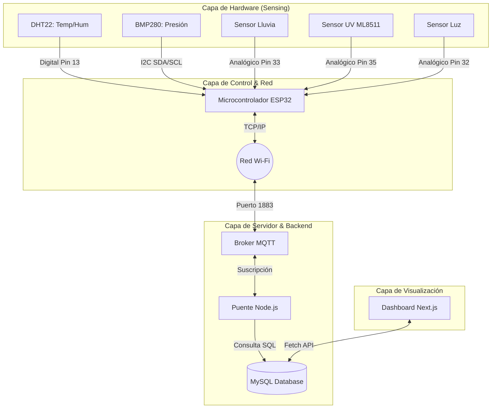
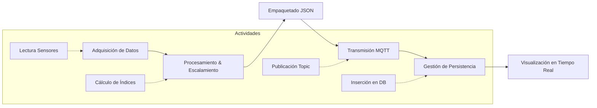
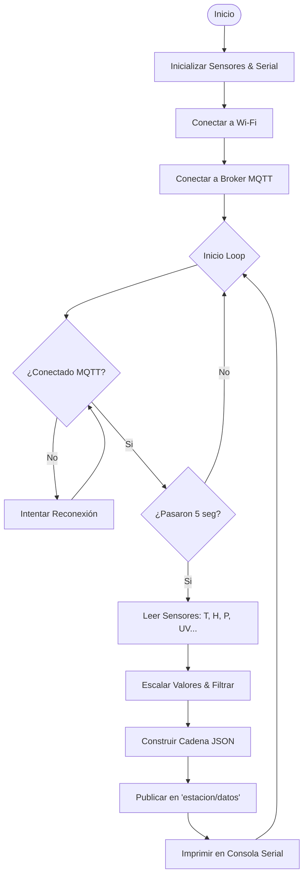

# Diagramas de Bloques del Sistema Meteorológico

Este documento contiene la representación visual de la arquitectura, funciones y procesos de la estación meteorológica basada en ESP32.

## 1. Diagrama de Bloques de Sistema (Arquitectura)
Este diagrama muestra los componentes individuales de hardware y software y cómo interactúan entre sí. Enfocado en la **estructura detallada**.

---

## 2. Diagrama de Bloques Funcional
Este diagrama describe las **funciones o actividades principales** del sistema y el flujo de información entre ellas.

---

## 3. Diagrama de Bloques de Procesos (Lógica)
Este diagrama visualiza los flujos de trabajo y pasos clave, actuando como un mapa del proceso de inicio a fin.

---

## Sugerencias de Uso
- **Usa el Diagrama de Sistema** para documentar el cableado y la infraestructura.
- **Usa el Diagrama Funcional** para presentaciones de alto nivel sobre "qué hace" el sistema.
- **Usa el Diagrama de Procesos** para depurar o explicar la lógica de programación.
