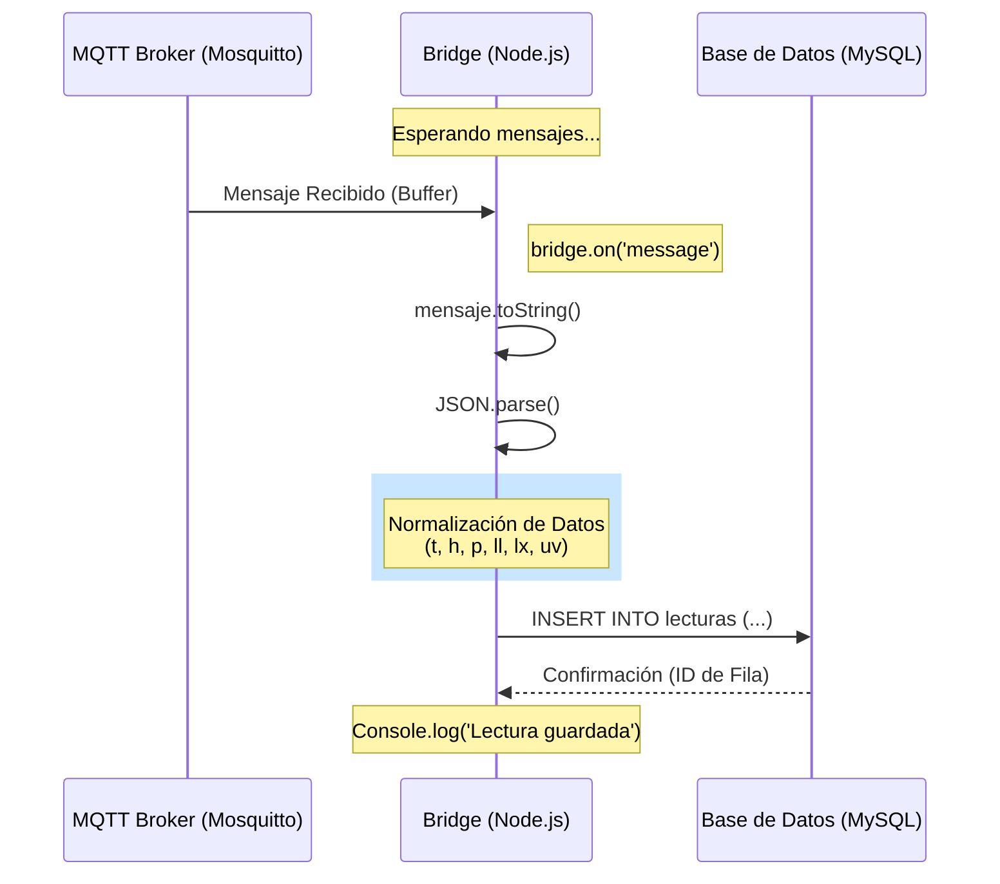
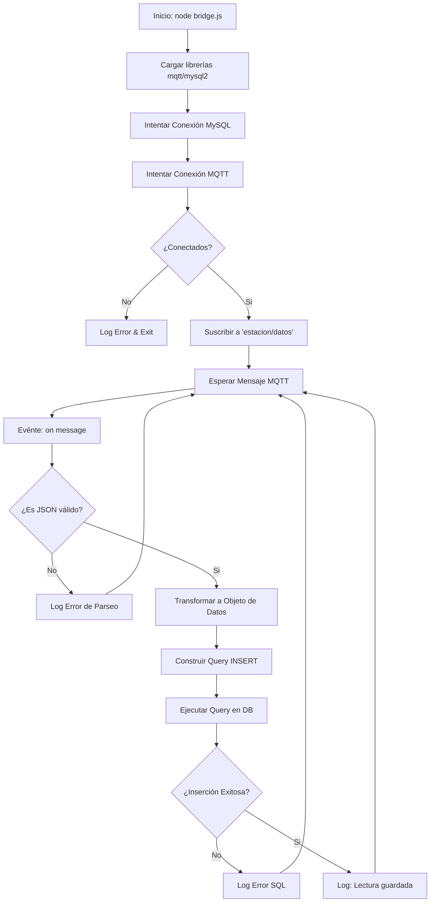
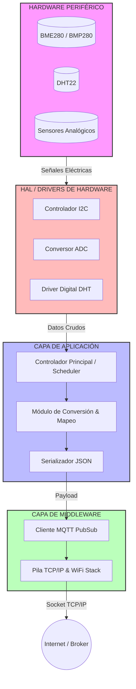
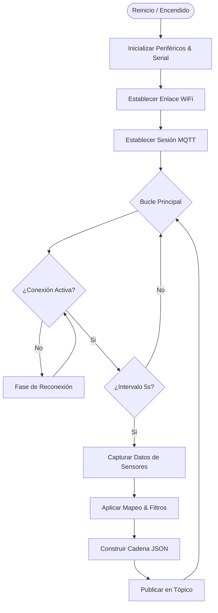

# Especificación Técnica Maestra del Software - Sistema de Sensores IoT

Este documento describe con precisión milimétrica el funcionamiento del software, su interacción con el hardware y la infraestructura de red.

---

## 1. Inventario de Librerías y Dependencias

### Firmware ESP32 (C/C++)
| Librería | Propósito Técnico | Función Práctica |
| :--- | :--- | :--- |
| **WiFi.h** | Gestión de la pila TCP/IP y radiofrecuencia. | Conecta el ESP32 al Router mediante SSID/Password. |
| **PubSubClient.h** | Cliente MQTT liviano. | Gestiona la comunicación con Mosquitto (Publicar/Suscribir). |
| **Wire.h** | Protocolo de comunicación I2C. | Interfaz para sensores digitales (BMP280) en pines 21/22. |
| **DHT.h** | Protocolo digital específico (OneWire). | Lectura sincronizada de pulsos para Temperatura/Humedad. |
| **Adafruit_BMP280.h** | Driver de alto nivel para Bosch BMP280. | Convierte registros hexadecimales del sensor en kPa/Pascal. |

### Backend Node.js
| Módulo | Propósito |
| :--- | :--- |
| **mqtt** | Suscriptor que escucha el tráfico de la red. |
| **mysql2** | Driver de alto rendimiento para persistencia en base de datos. |

---

## 2. Funcionamiento de la Infraestructura MQTT (Mosquitto)

El sistema utiliza un patrón **Publicador/Suscriptor (Pub/Sub)** mediado por **Mosquitto**:

1.  **El Broker (Mosquitto)**: Actúa como el servidor central (Dirección IP: `192.168.100.36`). No almacena datos permanentes, solo los "desvía" a quienes estén interesados.
2.  **Publicador (ESP32)**: Envía un paquete JSON al "Topic" (tópico) denominado `estacion/datos`.
3.  **Suscriptor (Bridge Node.js)**: Está "escuchando" ese tópico 24/7. En cuanto llega un mensaje, lo captura, lo procesa y lo guarda en MySQL.

---

## 3. Análisis de Bucles de Programación

### Bucle de Configuración (`setup()`)
Se ejecuta **una sola vez** al encender o resetear el ESP32:
1.  **Hardware Handshake**: Inicializa `Serial` (115200 baudios) para depuración y el bus `Wire` (I2C) para sensores.
2.  **Network Handshake**: Inicia la conexión Wi-Fi. El código se bloquea (`while != WL_CONNECTED`) hasta que obtiene una dirección IP local.
3.  **Configuración de Broker**: Define a qué servidor MQTT reportará los datos.

### Bucle de Ejecución (`loop()`)
Es el corazón dinámico del sistema. Funciona bajo dos pilares:
1.  **Mantenimiento de Conexión**: Verifica en cada vuelta si sigue conectado al Wi-Fi y MQTT. Si se desconecta, detiene todo para reintentar la conexión.
2.  **Multitarea no Bloqueante**: Usa la función `millis()` (un cronómetro interno). Esto permite que el ESP32 siga procesando otras tareas (como el cliente MQTT) mientras espera que pasen los 5 segundos para la siguiente lectura, evitando el uso de `delay()` que congelaría el sistema.

---

## 4. Captura y Procesamiento de Sensores (Hardware vs Software)

### Sensores Analógicos (ADC)
El ESP32 tiene un conversor de 12 bits (0 a 4095).
-   **Sensor de Lluvia**: Se usa la función `map(raw, 4095, 800, 0, 100)`. El software interpreta que 4095 es "Seco" y 800 es "Inundado", convirtiéndolo a un porcentaje comprensible para el usuario.
-   **Sensor UV (ML8511)**: Se lee el voltaje, se escala a 3.3V y se aplica la fórmula física: `(Voltaje - 1.0) * (10.0 / 1.8)` para obtener el Índice UV internacional.

### Sensores Digitales (I2C / OneWire)
-   **DHT22**: El software envía una señal de inicio de 18ms. El sensor responde con una ráfaga de 40 bits que el `DHT.h` decodifica en flotantes (ºC y %).
-   **BMP280**: Se comunica mediante registros. El ESP32 solicita los datos de presión, y el driver realiza compensaciones matemáticas internas para entregar el dato en hPa.

---

## 5. El Puente de Datos (bridge.js)

El archivo `bridge.js` es el componente de middleware que orquesta el movimiento de datos entre sistemas incompatibles (Protocolo de Red vs Protocolo de Base de Datos).

### Lógica de Operación
1.  **Conectividad Dual**: Inicia dos hilos de conexión paralelos: uno hacia el servidor de base de datos MySQL y otro hacia el Broker MQTT.
2.  **Mecanismo Asíncrono de Eventos**: Node.js utiliza un bucle de eventos. El script no "pregunta" si hay datos, sino que se queda en espera pasiva hasta que el sistema operativo le notifica que ha llegado un paquete del Broker.
3.  **Normalización de Esquema**: El código implementa una capa de compatibilidad mediante el operador `??` (nullish coalescing). Esto asegura que si el ESP32 envía `temp` o simplemente `t`, el sistema lo mapee correctamente antes de guardarlo.

### Diagrama de Secuencia del Puente
Este diagrama muestra cómo interactúa el script con los otros sistemas en tiempo real.

### Diagrama de Flujo del Proceso (Node.js)
Representa la lógica interna del script de JavaScript.

---

## 6. Diagramas de Lógica del firmware ESP32

Para cumplir con los estándares internacionales de ingeniería de software embebido, se presentan dos diagramas: uno de **Arquitectura (Estructura)** y otro de **Proceso (Funcionamiento)**.

### Diagrama de Bloques de Programación (Arquitectura por Capas)
Este diagrama sigue el estándar de **Arquitectura en Capas**, que es la norma en la industria para separar el hardware de la lógica de aplicación.

### Diagrama de Flujo de Funcionalidad (Lógica de Ejecución)
Este diagrama representa la secuencia de decisiones y el algoritmo que sigue el procesador desde el arranque.

